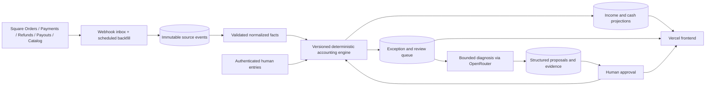

# Finance Loop — project plan

## 1. Goal and accounting boundary

Build a supervised operations tool for one or more Square merchants. It should explain revenue and item margins, record human-supplied cash activity, reconcile a *specific cash or bank account* to an observed balance, and route exceptions to a person. It is an operational subledger and reconciliation aid, not a tax filing or general ledger replacement. Every figure displays its source, period, currency, and calculation version.

The two loops share evidence but keep distinct meanings:

- **Income loop:** fulfilled sales and refunds drive recognized sales, item quantities, cost of goods sold (COGS), Square fees, and an operational margin. A Square payout is never sales revenue.
- **Cash loop:** opening cash balance plus actual inflows minus actual outflows yields an expected account balance. COGS is an analytical bridge, **not another cash deduction** when inventory purchases have already been booked as cash outflow. A Square payout is a cash inflow to the destination account, with its payout entries providing the trace to sales and fees.

For an MVP, choose **cash-basis operational reporting** (completed payments, refunds, fees, purchases and payouts) and label it as such. Formal accrual recognition, tax treatment, payroll accounting, inventory valuation, and multi-account intercompany transfers require separate rules and accountant review. Merchant timezone, reporting cutoff, currency, tax inclusion, tips, discounts, gift cards, partial refunds, chargebacks, and zero-dollar orders are explicit configuration or exception states, never implicit guesses.

## 2. Product scope

### MVP user roles

| Role | Can do | Cannot do |
|---|---|---|
| Owner/admin | Connect Square, create sellable Square catalog items, set account and period, manage users, approve corrections, close periods | Edit immutable source payloads |
| Operator | Enter cash events and balance observations; answer review questions; propose item definitions | Approve own high-risk corrections or change closed periods |
| Reviewer | Approve or reject proposed classifications and inferred transactions; reopen with reason | Alter Square facts |
| Read-only | Inspect dashboard, evidence, exports, audit trail | Mutate data |

### Human interactions in the diagram

1. Enter cash deposits, purchases, pay, miscellaneous spend, transfers out, and observed balances with date, account, amount, currency, memo and evidence.
2. Answer unknown-item and unclassified-transaction questions. A proposed item records SKU/catalog ID, units, cost basis, effective date, and provenance. Approval precedes canonical use. An owner can also create a sellable Square catalog item by entering its name, variation, sale price, and optional SKU; a supplier-backed unit cost and evidence are saved in Finance Loop at the same time. Opening stock is recorded separately.
3. Inspect discrepancy investigations, compare source records, accept or reject a proposed missing transaction, and rerun reconciliation.
4. See failure states and manually resolve them with a reason and audit record.

## 3. Architecture



Recommended implementation:

| Layer | Choice | Reason |
|---|---|---|
| Frontend | Next.js + TypeScript on Vercel | Fits planned deployment; server routes can protect secrets and expose an authenticated UI |
| Persistence | Supabase Postgres | Transactions, constraints, audit history, and precise numeric data suit a relational database |
| Identity | Supabase Auth + Postgres RLS | Per-organization isolation and least privilege; server secret remains server-only |
| Background work | Durable queue/worker with scheduled catch-up | Webhooks can be duplicated, delayed or out of order; financial runs must resume safely |
| Square | OAuth and server-side API client | Orders for line items, Payments/Refunds for settlement, Payouts + entries for bank transfers, Catalog for identifiers |
| Agent | OpenRouter `openai/gpt-6-luna` | Structured diagnosis and question drafting; never performs arithmetic or writes ledger rows directly |

The UI in this repository is deliberately dependency-free to make the workflow reviewable before production services are connected. Move its view logic to Next.js after the data contracts are accepted.

## 4. Square ingestion contract

Use OAuth with the minimum scopes required for Orders, Payments, Refunds, Catalog, Locations, and Payouts. Square catalog creation additionally requires `ITEMS_WRITE`; do not request other write scopes. Only an authenticated owner can create an item. Store tokens encrypted server-side. Pin a Square API version and test sandbox and production behavior before launch.

1. Subscribe to relevant webhooks. Verify the **raw body** with Square's signature and configured notification URL before processing. Persist notification ID, event type, merchant/location, received time, payload and signature result. Acknowledge quickly; enqueue work.
2. Upsert by Square object ID and version/update timestamp. Deduplicate notification IDs; tolerate reordered delivery. Fetch the authoritative object after a webhook, rather than trusting a partial event payload.
3. Run paginated backfills for the configured period with an overlap window. Keep per-object cursors and a last successful sync marker. Flag gaps, permission loss, rate limits, and stale sync in the UI.
4. Join Order line items to Payments and Refunds by order/payment IDs. Resolve Catalog variation IDs to effective-dated item definitions. Never match solely by product name.
5. Map payout entries to payment/refund IDs and payout destination. Account for fees, reversals, holds and failed payouts as separate facts. Do not assume a payout's arrival date equals a sale date.
6. Preserve original currency minor units. Do not combine currencies without an explicit conversion record.

## 5. Deterministic calculation rules

All money is signed **integer minor units** plus ISO currency. Store unit cost as fixed-scale decimal or cost per unit in minor units. Version each calculation policy. Never ask an LLM to sum or choose a balancing amount.

For period `P` and a defined sale inclusion policy:

```text
gross_item_sales = sum(completed line-item extended prices before discounts)
net_sales = gross_item_sales - discounts - refunds - excluded tax/tips/gift-card liability
units_sold = sum(sale quantity) - sum(returned quantity)
COGS = sum(sold quantity × effective-dated approved unit cost) - approved return reversals
operational_margin = net_sales - COGS - actual Square processing fees
```

Exact tax, tip, service charge and fee treatment is a merchant policy fixed before production. Reconcile order totals to payment totals and flag any unexplained difference. If an item cost or currency is missing, show an **incomplete** margin rather than zero cost.

For a Square sale line with neither an item name nor a catalog variation, the merchant-approved pass-through policy sets that exact line's unit COGS to the unit price supported by Square sale evidence. If only an extended line amount is available, derive a unit amount only when it divides evenly by a positive whole quantity; otherwise leave the cost unresolved. Record the assumption in the audited line-specific approval. This rule does not create a cost for other or future sales.

For a named account `A`, cutoff `T`, and opening balance observation `B0`:

```text
expected_balance(A,T) = B0
  + posted Square payouts to A
  + confirmed manual deposits to A
  + confirmed other cash inflows to A
  - confirmed purchases/pay/miscellaneous outflows from A
  - confirmed transfers out of A
  ± explicitly approved adjustments
discrepancy = observed_balance(A,T) - expected_balance(A,T)
```

Cash flow from operations and net cash flow are derived *views* over classified cash movements. COGS can be displayed beside operating cash flow as a bridge but cannot be subtracted again from the account balance. Transfers between tracked accounts create paired, linked movements; a transfer out is not a business expense. If only one side is visible, its counterparty is an exception. Cash deposits from a cash drawer into a bank account similarly require account-aware transfer treatment to avoid double counting total business cash.

Reconciliation uses a configurable tolerance in minor units (default 0 for a single USD account). An exact match or approved tolerance moves to `matched`; an unexplained delta cannot be silently posted as an adjustment.

## 6. Agent boundaries and state machines

The agent receives only necessary records with stable IDs and redacted sensitive fields. It returns JSON conforming to a schema: `issue_type`, `candidate_source_ids`, `proposed_category`, `confidence`, `rationale`, `missing_evidence`, `question`, `policy_version`. A validator rejects unknown IDs, unauthorized categories, impossible dates, currencies or amounts. The model output is a **proposal**.

### Income / inventory states

`monitoring → diagnosing → [item_proposed | awaiting_clarification | resolved | failed] → monitoring`

- Unknown Square catalog variation: locate exact catalog ID and candidate metadata. If approved cost is absent, hold COGS for affected sales. The agent may draft an item definition; the reviewer supplies cost and effective date.
- Receipt cost helper: a user may paste bounded, unstructured receipt text for extraction into an editable draft. The extraction model does not identify catalog items or write costs. Separately, an owner or reviewer may ask Jev through OpenRouter to choose an exact same-currency inventory option for each uploaded receipt line, or none. The server constrains choices to current inventory entries and maps temporary option keys back to exact item identities; Jev output only pre-fills editable review fields. A human verifies or changes each identity, confirms unit acquisition cost and effective date, attaches receipt evidence, and approves the effective-dated COGS update. The update is audited and triggers a projection replay when it can affect current reports; purchase cash and stock are recorded separately.
- Unnamed sale line with no catalog variation: offer the Square-supported unit price as a pass-through cost for that exact line, with the assumption recorded in the human approval reason. If source amounts do not support an exact per-unit value, leave the cost unresolved.
- Ambiguous transaction: ask a targeted question showing the source record and why classification matters. After human response, recompute affected projections.
- Invalid or missing source facts: fail with a reason code and retry policy. Do not fabricate an item or classify from a plausible name alone.

### Cash reconciliation states

`monitoring → investigating → [proposal_pending | awaiting_human | matched | failed]`

- Detect delta only after a fresh observed balance and synchronized source window.
- Search known unmatched payouts, human entries, duplicate events, date cutoffs and linked external records. A candidate entry must cite an actual source record.
- A typical-category candidate can become a draft, never an automatic posted transaction. Human approval creates the entry with a link to evidence. Recompute from source facts and compare again.
- Bound the loop: one investigation per data revision; at most three machine proposals; stop on unchanged evidence or repeated mismatch. Surface `failed` with a complete trace.

### Failure states to expose

| Code | Trigger | UI / recovery |
|---|---|---|
| `SOURCE_STALE` | Square sync beyond freshness target | Show last sync; retry and backfill |
| `SOURCE_GAP` | Pagination, permission or webhook gap | Pause close; operator investigates |
| `UNKNOWN_ITEM` | Catalog ID lacks approved effective cost | Ask human; margin incomplete |
| `AMBIGUOUS_CLASSIFICATION` | Multiple or no supported categories | Ask human with evidence |
| `CURRENCY_MISMATCH` | Mixed currency in a calculation | Stop affected projection |
| `BALANCE_MISMATCH` | Observed and expected differ | Investigate, then review proposal |
| `UNSUPPORTED_ACTIVITY` | Hold, chargeback, failed payout, etc. lacks rule | Escalate to reviewer |
| `MODEL_UNAVAILABLE` | Timeout, invalid JSON or quota | Keep deterministic system running; human review |
| `REPEATED_MISMATCH` | Recompute did not converge | Stop loop and contact human |
| `PERIOD_CLOSED` | Correction targets a closed period | Require reopen or dated adjustment with approval |

## 7. Data model and audit

The proposed SQL in `supabase/schema.sql` provides organizations, memberships, accounts, source events, item definitions, normalized sale lines, cash movements, observations, projection runs, issues, proposals and audit events. Production migrations should add policy-specific tables as rules harden.

Key invariants:

- Source payloads are append-only; a corrected Square fact is a new version or superseding record.
- Natural unique keys include `(organization_id, provider, provider_object_id, version)` and idempotency keys for human writes.
- Approved item costs are effective-dated; recomputation records which version was used.
- Every human mutation captures actor, timestamp, before/after, reason and evidence reference.
- Derived snapshots are rebuildable from source facts and policy version. No projection is the sole record of truth.
- Supabase RLS isolates organizations; all browser access uses a publishable key with authenticated policies. Service keys and external API keys remain server-side.

## 8. Screens and workflow

### Inventory and analytics release (October 2, 2026)

Inventory quantity tracking and product analytics are enabled in the release
configuration. Server environment examples default both flags on, and migration
`202610020006_enable_inventory_and_product_analytics.sql` enables current and
future organizations. Deployments must also set both server-side Vercel
variables to `true`. Supply receipts link to one actual purchase cash outflow;
evidence-backed opening stock and manual corrections append quantity records
without changing cash. Product reports show item revenue, approved COGS, and
contribution before processing fees. Actual Square fees remain an aggregate
cost deducted after item-level margin to calculate report-wide operational net;
they are not attributed to products. Missing-data exceptions and unallocated
refunds remain visible. The receipt text helper drafts extraction only; a
human maps catalog identity and approves any effective-dated COGS update.
Product analytics remains deterministic. Quantity tracking does not establish
formal inventory valuation or an accounting net-income statement; pilot
reconciliation and merchant and accounting-adviser sign-off remain separate
readiness requirements. See [the inventory and analytics rollout
contract](docs/STAGED_INVENTORY_ANALYTICS.md).

1. **Overview:** income, cash, sync freshness, unresolved issues, period and account selector; each metric links to its calculation.
2. **Income & inventory:** Square sales by item, unit cost status, fees, margin, item definition review, and owner-only in-app management of Square items and variations. Item costs remain separate effective-dated, evidence-linked approvals; archived items stay available to historical calculations.
3. **Cash flow:** dated inflow/outflow register, cash category breakdown, expected vs observed balance, manual entry form.
4. **Review queue:** unknown items, unclassified transactions, suspected missing cash entries; source evidence and approve/reject/request clarification.
5. **Ledger / audit:** read-only event timeline, versions, actor and decision trail, export.
6. **Settings:** Square connection health, mapping policies, account opening balance, tolerance, notification recipients, roles.

The prototype implements the first five as local demo workflows. Each demo control is labeled; no external mutation is implied.

## 9. API / service boundaries

| Endpoint or job | Input | Output / guard |
|---|---|---|
| `POST /api/square/webhook` | Raw signed payload | Verify signature, persist once, enqueue; no accounting in request |
| `POST /api/sync` | Merchant, bounded period | Admin only; idempotent backfill job ID |
| `GET /api/dashboard` | Account, date range | Projection version, source freshness, incomplete flags |
| `POST /api/manual-movements` | Type, amount, account, date, memo, evidence, idempotency key | Validate and audit; two-person approval for threshold categories |
| `POST /api/observations` | Account, timestamp, amount, evidence | Validate cutoff and create reconciliation run |
| `POST /api/square/catalog-items` / `PATCH /api/square/catalog-items` | Item details and variations, archive/restore action, reason, idempotency key | Owner-only Square Catalog writes; versioned source facts and audit event. Never hard-delete an item with historical references. |
| `POST /api/inventory/catalog-items` | Item, variation, sale price, optional SKU, supported unit cost, effective date, supplier evidence, idempotency key | Owner-only; upsert Square Catalog, persist the returned variation fact, record audited COGS, and queue a projection replay |
| `POST /api/issues/:id/proposals` | Agent structured output | Validate against source IDs and policy; draft only |
| `POST /api/proposals/:id/decision` | approve/reject, reason | Reviewer authorization, optimistic version check, audit, recompute |
| `POST /api/runs/:id/replay` | Existing run ID, new policy version | Deterministic rebuild; compare diffs |

Every write uses CSRF/session checks, request validation, authorization, idempotency, and a database transaction. The Square and OpenRouter clients run only on the server. Rate limit interactive investigation calls and cap token spend per organization.

## 10. Delivery phases and exit criteria

| Phase | Deliverables | Exit criterion |
|---|---|---|
| 0. Policy decisions | Account scope, basis, tax/tip/discount treatment, timezone/currency, cost method, tolerance, approvers | Signed-off examples for sales, returns, fee and cash cases |
| 1. Data foundation | Supabase migrations/RLS, Auth roles, append-only source inbox, audit and idempotency | Cross-org access tests pass; replay produces identical result |
| 2. Square read integration | OAuth, signed webhooks, polling/backfill, Orders/Payments/Refunds/Payouts/Catalog normalization | Sandbox fixtures reconcile to Square exports; duplicate and reordered events harmless |
| 3. Deterministic engine | Versioned calculations, account-aware cash register, exception generation | Golden fixtures cover edge cases; integer-cent totals stable |
| 4. Supervised agent | OpenRouter structured diagnoses, validation, proposal queue, approval flow | Agent cannot post ledger facts; invalid output fails closed |
| 5. Production UI | Next.js screens, notifications, evidence links, exports, accessibility | Operators complete each diagram scenario end to end |
| 6. Pilot and hardening | Parallel run against merchant statements, monitoring, backups, incident runbook | Multiple statement periods reconcile; accountant reviews differences |

## 11. Tests and operational controls

### Purchase Receipt Inbox

Supplier purchase documents can enter through authenticated manual upload or an
organization-bound integration credential. Integration credentials permit intake
and status reads only; they cannot approve costs, inventory, or cash. The upload
flow registers an immutable submission, transfers bytes to a restricted private
storage destination, verifies the file, and durably queues document processing.
The same workflow supports Power Automate without depending on its Teams/email
trigger implementation. See `docs/PURCHASE_RECEIPTS.md` and
`docs/POWER_AUTOMATE_SETUP.md` for the API and deployment contract.

Document extraction produces a persisted, evidence-linked draft. Jev inventory
matching is an on-demand aid that fills editable browser fields only and is not
persisted or approved. A verified owner/reviewer confirms or changes the exact
item choices, then approves an explicit draft version, reason, and selected
effects through one transactional database boundary. Receiving stock,
updating an effective-dated cost, and confirming a payment are separate decisions
and can occur on separate dates. A document total or authorization hold does not
prove an account cash outflow. Linking an existing purchase movement must not
create another payment; a credit-card purchase must not deduct checking before
its actual settlement. Later approvals can finish pending receipt/payment effects
without duplicating earlier effects.

Keep original goods amounts and printed totals in integer minor units; preserve
package-to-selling-unit conversions and explain any approved per-unit rounding
variance. Purchase tax/shipping remain separate from item cost under the confirmed
merchant policy. Discounts already reflected in line amounts are not subtracted
again. Unknown pack composition, item identity, currency, or amounts stay visible
until supported by evidence. COGS on sale never deducts purchase cash a second time.

Acceptance covers cross-organization isolation, restricted credential scope,
duplicate delivery and approvals, independent delivery/payment timing, existing
movement links, immutable draft evidence, closed periods, projection replay, OCR
failures, and bounded per-organization model spending. Live migrations and pilot
sign-off remain explicit deployment gates.

- Golden fixture tests for discounts, tax/tips, partial refunds, returns, split tenders, missing costs, failed payouts, duplicate webhooks and out-of-order updates.
- Property tests for replay idempotence, unchanged balance under internal transfers, and no COGS double deduction.
- Authorization tests for RLS, reviewer separation, closed periods, and immutable source data.
- Daily reconciliation of source counts and sums against Square exports; alert on stale sync, queue lag, failed webhook verification, incomplete margins and unresolved mismatches.
- Keep structured logs with correlation IDs and provider IDs, redacted PII, model version, prompt template version and token usage. Capture no card data.
- Backups plus periodic restore drills; migration rollback plan; retention schedule set with the merchant and accounting adviser.

## 12. Open decisions before live data

### Confirmed merchant choices (September 30, 2026)

- Start with one central operating checking account. Its nickname, opening balance, and dated cutoff are entered in configuration; no bank account number is needed in this project.
- Report in USD and the `America/New_York` timezone. Exclude sales tax from operational revenue. Approved inventory unit cost is the purchase price excluding purchase tax and miscellaneous purchase charges.
- Gift-card issuance is a cash inflow and gift-card liability movement, not item revenue or inventory COGS. A purchase paid with a gift card is recognized as an ordinary item sale with that item's approved COGS; gift-card redemption reduces the liability. Square activation/load/redemption evidence must be present before a complete gift-card liability projection is claimed.
- Reconciliation tolerance is an administrator-configured value in minor units. Correction authority is assigned to specific administrators, separate from ordinary entry rights.

The opening observation, exact cutoff, tolerance value, named correction administrators, tip/discount/refund treatment details, and payout account mapping are still configuration or review inputs. No live projection should infer them.

1. Enter the central checking account nickname, opening balance and date/time, and map Square payout destination to it. Add more tracked accounts only through an explicit account policy.
2. Decide whether any formal financial statement will expense purchases or capitalize inventory; this operational dashboard displays purchase cash outflow and COGS on sale separately.
3. Confirm tip, service-charge, discount, refund, chargeback, hold, and failed-payout rules with worked examples. Sales tax is excluded; gift cards follow the liability/redemption rule above.
4. Is this for one merchant/location or multi-tenant SaaS from day one? The schema anticipates multi-tenant use.
5. Name the specific correction administrators and thresholds for a second approver; decide who approves routine item costs and inferred cash entries.
6. Which external bank evidence exists? Without bank feed or statement import, the observed balance and unmatched bank activity remain human supplied.

## References

- [Square Orders](https://developer.squareup.com/reference/square/orders), [Payments](https://developer.squareup.com/reference/square/payments-api.), [Payouts](https://developer.squareup.com/reference/square/payouts-api), [payout entries](https://developer.squareup.com/docs/payouts-api/list-payout-entries), [webhook verification](https://developer.squareup.com/docs/webhooks/step3validate)
- [Supabase RLS](https://supabase.com/docs/guides/database/postgres/row-level-security), [secure data](https://supabase.com/docs/guides/database/secure-data)
- [OpenRouter GPT-6 Luna](https://openrouter.ai/openai/gpt-6-luna), [structured outputs](https://openrouter.ai/docs/guides/features/structured-outputs)
